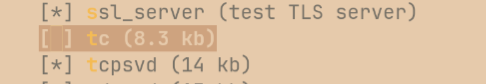
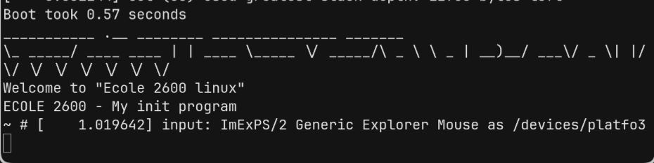

# Security OS

- Mettre en place une image linux avec NFS / from scratch (avec alpine)
- Ajouter des appels systèmes directement
    - Dans le noyau (In tree)
    - En tant que module (Out-of-tree)
- Mettre en place un rootkit
- Mettre en place un EDR


## Image Linux NFS

### Compilation et programme init (PID 1)

Compilation du noyau et de Busybox en static 
Mise en place de init avec son arborescence de fichiers

1. Récupérer le noyau linux sur [kernel.org](https://kernel.org)

Traditionnellement le noyau se trouve à : 
```sh 
cp ~/Téléchargement/linux-xxx /usr/src/linux-xxx
```

2. Activer les options pour NFS *Network File System*
```shell
make nconfig
 
"Networking support" --> "Networking options" --> "IP:kernel level autoconfiguration".

"File system" --> "Network File System" --> "Root file system on NFS(NEW)" 
```

> Sortie : $KERNEL_DIR/linux-xxx/arch/x86/boot/bzImage


3. Ecrire le programme "my_init.c" permettant de lancer un shell à la fin du démarrage (séquence du bootloader enregistrée dans le MBR de l'UEFI / BIOS)

```
(UEFI) MBR <-- (GRUB) Bootloader "insert linux kernel" + "insert initrd process /  daemon"
```

4. Récupérer busybox
```sh
git clone git://git.busybox.net/busybox
cd busybox

make defconfig
make
make install
```
Troubleshoot : "error: « TCA_CBQ_MAX » non déclaré"
```sh
make menuconfig
```
- Décocher :  Network Utilities --> [ ] tc


```sh
qemu-system-x86_64 -enable-kvm -cpu host \
    -kernel /path/to/bzImage \
    -initrd $BUILDS/initramfs.cpio.gz \
    -append "console=ttyS0" -nographic
```


Nous avons 
- l'image du kernel compilé qui a nfs configuré: bzImage
- le programme init qui install le FS et les cmd de busybox : initramfs.gpio.gz

### Serveur et client NFS
---


Pour NFS, Qemu se connecte au serveur nfs de l'hôte. Il n'y a donc pas besoin du fichier *.cpio.gz.

Monter le rootfs (ici initramfs) traditionnellement dans `/srv/nfs/`
```sh
# la modification de initramfs est répercutée sur qemu
mount --bind $HOME/Documents/ecole_2600/security-os/tp1/initramfs /srv/nfs
```

Voici les configurations :

| Machines |  IP local | IP Qemu |  Point de montage des fichiers |
|:-------- |:--------:| :--------: |:--------:|
| Ryoku : ArchOS | 127.0.0.1:2049 | 10.0.2.2 | /srv/nfs/qemu-kernel/ |
| Emulateur Qemu | 127.0.0.1 | 10.0.1.15 | / |

```sh
# fichier /etc/export

/srv/nfs/qemu-kernel    127.0.0.1(rw,sync,insecure,no_root_squash,no_subtree_check)
```
> La machine est sur 10.0.2.0/24 mais Qemu communique sur le port 2049 (NFS) avec 127.0.0.1 
> => Ne pas mettre le réseau de Qemu !

Lancement de l'émulateur
---

```sh

sudo qemu-system-x86_64 \
  -enable-kvm -cpu host \
  -kernel $HOME/Documents/ecole_2600/security-os/tp1/linux-kernel/bzImage \
  -netdev user,id=net0 \
  -device e1000,netdev=net0 \
  -append "root=/dev/nfs nfsroot=10.0.2.2:/srv/nfs/qemu-kernel,vers=3,tcp,nolock rw ip=10.0.2.15::10.0.2.2:255.255.255.0::eth0:off console=ttyS0 raid=noautodetect init=/init" \
  -nographic
```

Remarque :  init est le programme qu'on a fait et non celui de busybox !

Bilan : 
- Récupération du noyau linux dans `/usr/src/` et compilation de l'image dans `tp1/linux-kernel`
- création d'un Système de fichier (initramfs) et des programmes de busybox avec un programme init dans `initramfs/init && initramfs/init_loop`
- Mise en place d'un serveur NFS sur le système hôte
- Lancement de la machine avec Qemu


# Modules out-of-tree

Pour ajouter des appels systèmes, on les écrit en C en dehors du noyau afin de les rajouter avec `insmod program.ko` 
Les modules ne diposent pas de la glibc mais des fonctions natives du noyau.
Pour bien comprendre, tp2, présente une façon d'écrire un module OOT(Out-Of-Tree).
- Création d'un périph misc nommé "version" : `/dev/version`
- La lecture renvoie la version actuelle du noyau : `cat /dev/version`
- l'écriture change la version du noyau (affiché dans `/dev/version`) : `echo "1.2.3" > /dev/version`
- l'utilisation de ioctl : (à implémenter)


